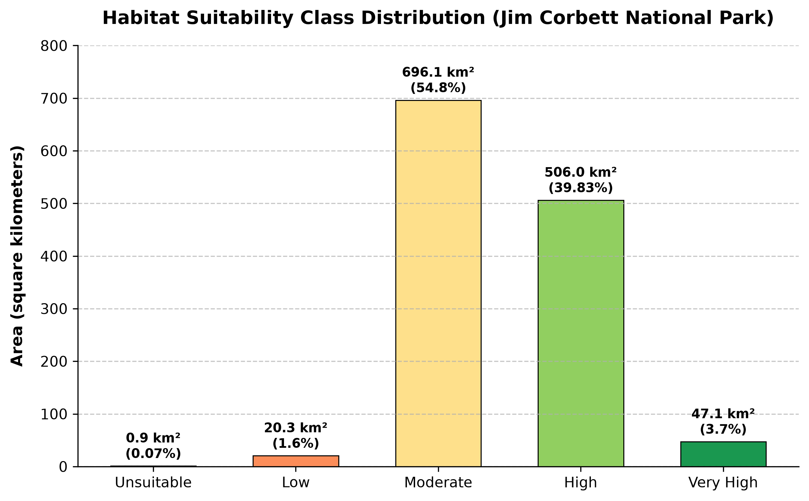

# Project Code & Title: P6 – Habitat or Ecological Suitability Mapping using GIS-Based Weighted Overlay and Environmental Variables

**Project Report Submitted in fulfillment of the Requirements for the Award of the Internship of Summer Training Program Space Science Technology**  
**Subject Name:** Summer Internship on Remote Sensing, GIS, Artificial Intelligence, and Python  

**By:**  
**Participant Name:** Aashin Krishna A S  
**Institute Name:** Department of Space Education  
**Institute Roll No.:** ISA-2026-P6-042  
**Enrollment No.:** ISA/2026/STP/042  

**Under the Supervision of:**  
**Miss. Alisha Sinha** (Program Supervisor)  

**India Space Academy, Department of Space Education, India Space Week**  

---

## Table of Contents
1. [Title](#1-title)
2. [Objective](#2-objective)
3. [Study Area](#3-study-area)
4. [Data Used](#4-data-used)
5. [Methodology](#5-methodology)
   - [5.1 QGIS-Based Workflow](#51-qgis-based-workflow)
   - [5.2 Python-Based Automated Workflow](#52-python-based-automated-workflow)
6. [Results](#6-results)
   - [6.1 Processed & Reclassified Rasters](#61-processed--reclassified-rasters)
   - [6.2 Habitat Suitability Index (HSI) Map](#62-habitat-suitability-index-hsi-map)
   - [6.3 Land-Based Area Statistics](#63-land-based-area-statistics)
7. [Conclusion](#7-conclusion)
8. [References](#8-references)

---

## 1. Title
**Project Code:** P6  
**Full Project Title:** Ecological Niche and Habitat Suitability Analysis in Jim Corbett National Park Using Multi-Criteria Decision Evaluation and Spatial Overlay Modeling  

---

## 2. Objective
This investigative study formulates an empirical Multi-Criteria Decision Analysis (MCDA) model tailored to evaluate macro-ecological zone suitability for key wildlife species (*Panthera tigris* and *Elephas maximus*) across the protected terrestrial domain of **Jim Corbett National Park, Uttarakhand, India**. 

By synthesizing high-fidelity multi-spectral Sentinel-2 bands, digital elevation models (DEM), and neural-network derived Land Use / Land Cover (LULC) composites, the project quantifies spatial habitat viability across a standardized 10-meter raster grid mesh.

---

## 3. Study Area
- **Geographic Domain:** Jim Corbett National Park
- **Administrative Location:** Districts of Nainital & Pauri Garhwal, Uttarakhand State, Northern India
- **Bounding Coordinates:** 29.40°N to 29.75°N Latitude, 78.75°E to 79.15°E Longitude
- **Geospatial Reference Frame:** WGS 84 / UTM Zone 44N Transverse Mercator (EPSG:32644)
- **Grid Cell Resolution:** 10 meters per pixel

Situated within the Shivalik foothill ecosystem, the park encompasses approximately 1,270.40 sq. km of non-aquatic land mass. The region exhibits notable topogeographic variations, transitioning from riverine grasslands (*Chaurs*) bordering the Ramganga River to steep ridge systems covered in dense Sal (*Shorea robusta*) canopy.

### Area of Interest (AOI) Map


---

## 4. Data Used

| Data Category | Dataset Identifier | Data Provider / Origin | Portal Link | Spectral / Technical Spec | Temporal / Grid Spec |
| :--- | :--- | :--- | :--- | :--- | :--- |
| **Multispectral Satellite** | Sentinel-2 L2A | ESA Copernicus Open Access | [https://scihub.copernicus.eu/](https://scihub.copernicus.eu/) | B02 (Blue), B03 (Green), B04 (Red), B08 (NIR) | Nov 2024 / 10m Spatial |
| **Topographic Surface** | ALOS PALSAR / SRTM DEM | USGS EarthExplorer Portal | [https://earthexplorer.usgs.gov/](https://earthexplorer.usgs.gov/) | Elevation (m) & Surface Slope (Degrees) | 10m Reprojected |
| **Land Cover Mapping** | Dynamic World Composite | WRI & Google | [https://dynamicworld.app/](https://dynamicworld.app/) | 9-Class Neural Land Cover Probability | 2024 Median Composite |
| **Vector Boundary** | Spatial AOI Shapefile | GADM Administrative Data | [https://gadm.org/](https://gadm.org/) | Polygon Feature (`Corbett_AOI.shp`) | EPSG:32644 Projected |

---

## 5. Methodology

The analytical framework executes multi-criteria decision evaluation across two primary computational environments: **QGIS GIS Desktop Platform** and **Python Geospatial Automated Stack**.

### 5.1 QGIS Desktop Analytical Sequence
1. **Spatial Boundary Normalization**:
   - Import administrative shapefile boundary (`Corbett_AOI.shp`) and multispectral imagery.
   - Crop all input rasters using `Raster -> Extraction -> Clip Raster by Mask Layer`.
2. **Environmental Variable Generation**:
   - **Vegetation Density Index (NDVI)**: Computed via Raster Calculator:
     `NDVI = (NIR - Red) / (NIR + Red) = (B8 - B4) / (B8 + B4)`
   - **Surface Terrain Slope**: Extracted from DEM using `Raster -> Analysis -> Slope`.
   - **Hydrological Proximity**: Extracted water pixels (Class 0 in Dynamic World) and computed Euclidean proximity via `Raster -> Analysis -> Proximity (Raster Distance)`.
3. **Multi-Factor Criteria Reclassification**:
   - Standardized all continuous input variables to a 5-tier ordinal rating (1 = Poor/Unsuitable, 5 = Premium/Very High):
     - **NDVI Canopy**: <= 0.20 -> 1, 0.20-0.35 -> 2, 0.35-0.45 -> 3, 0.45-0.55 -> 4, > 0.55 -> 5
     - **Water Proximity**: <= 250m -> 5, 250-500m -> 4, 500-1000m -> 3, 1000-2000m -> 2, > 2000m -> 1
     - **LULC Classes**: Dense Forest -> 5, Shrubland/Grass -> 4, Wetlands/Flooded -> 3, Crops -> 2, Built/Bare -> 1
     - **Slope Angle**: <= 5° -> 5, 5-15° -> 4, 15-25° -> 3, 25-35° -> 2, > 35° -> 1
     - **Elevation Height**: <= 300m -> 5, 300-500m -> 4, 500-700m -> 3, 700-900m -> 2, > 900m -> 1
4. **Weighted Linear Combination (WLC)**:
   - Evaluated combined Habitat Suitability Index (HSI) via Raster Calculator:
     `HSI = 0.30 * NDVI + 0.25 * WaterDistance + 0.20 * LULC + 0.15 * Slope + 0.10 * Elevation`
5. **Categorical Zone Masking**:
   - Classified continuous HSI values into 5 zones: Unsuitable ([1.0, 1.8)), Low ([1.8, 2.6)), Moderate ([2.6, 3.4)), High ([3.4, 4.2)), Very High (>= 4.2). Surface water bodies were masked out to isolate terrestrial land.
6. **Vector Transformation & Area Quantification**:
   - Polygonized suitability classes via `Raster -> Conversion -> Polygonize`.
   - Executed field geometry area calculation: `area($geometry) / 1000000 -> Area (sq. km)`.
7. **Cartographic Composition**:
   - Assembled final map layout incorporating scale bar, directional indicator, coordinate grid, legend, and metadata.

---

### 5.2 Python Automated Analytical Engine

The full processing chain is programmatically executed using modular Python components (`src/`) coordinated by `run_pipeline.py`.

#### 5.2.1 Preprocessing Module (`src/preprocessing.py`)
```python
import os
import numpy as np
import geopandas as gpd
import rasterio
from rasterio.mask import mask as rasterio_mask
from rasterio.warp import reproject as warp_reproject, Resampling

def clean_raster(input_path, output_path, aoi_gdf, nodata_value):
    """
    Clips and masks a raster to the AOI boundary shapefile and saves it as GeoTIFF with LZW compression.
    """
    with rasterio.open(input_path) as src:
        # Reproject AOI geometry to match raster CRS
        aoi_proj = aoi_gdf.to_crs(src.crs)
        
        # Mask the raster to the AOI boundary
        clipped, transform = rasterio_mask(
            src,
            aoi_proj.geometry,
            crop=True,
            nodata=nodata_value
        )
        
        # Prepare output profile (convert to GTiff)
        profile = src.profile.copy()
        profile.update(
            driver="GTiff",
            height=clipped.shape[1],
            width=clipped.shape[2],
            transform=transform,
            compress="lzw"
        )
        
        # Write to destination file
        with rasterio.open(output_path, "w", **profile) as dst:
            dst.write(clipped)
            
    print(f"Clipped raster saved to: {output_path}")
    return output_path

def calculate_ndvi(red_path, nir_path, output_path):
    """
    Calculates NDVI from clipped Red and NIR bands, clips range to [-1, 1],
    handles divide-by-zero, and saves as a float32 GeoTIFF.
    """
    with rasterio.open(red_path) as red_src, rasterio.open(nir_path) as nir_src:
        red_arr = red_src.read(1).astype("float32")
        nir_arr = nir_src.read(1).astype("float32")
        
        # Set up error handling for division by zero
        np.seterr(divide="ignore", invalid="ignore")
        
        # Calculate NDVI
        ndvi = np.where(
            (nir_arr + red_arr) == 0,
            np.nan,
            (nir_arr - red_arr) / (nir_arr + red_arr)
        )
        ndvi = np.clip(ndvi, -1, 1)
        
        # Save output as GeoTIFF
        profile = red_src.profile.copy()
        profile.update(
            driver="GTiff",
            dtype="float32",
            count=1,
            compress="lzw"
        )
        
        with rasterio.open(output_path, "w", **profile) as dst:
            dst.write(ndvi.astype(np.float32), 1)
            
    print(f"NDVI calculated and saved to: {output_path}")
    return output_path

def reproject_raster(source_path, reference_path, output_path, is_discrete=False):
    """
    Reprojects a source raster to match the coordinate system, resolution, 
    and shape of a reference raster. Uses nearest-neighbor for discrete LULC
    and bilinear for continuous layers. Saves as GeoTIFF.
    """
    with rasterio.open(source_path) as src, rasterio.open(reference_path) as ref:
        resampling = Resampling.nearest if is_discrete else Resampling.bilinear
        dtype = src.profile["dtype"]
        
        destination = np.empty((ref.height, ref.width), dtype=dtype)
        
        warp_reproject(
            source=rasterio.band(src, 1),
            destination=destination,
            src_transform=src.transform,
            src_crs=src.crs,
            dst_transform=ref.transform,
            dst_crs=ref.crs,
            resampling=resampling
        )
        
        profile = ref.profile.copy()
        profile.update(
            driver="GTiff",
            dtype=dtype,
            count=1,
            compress="lzw"
        )
        
        if src.nodata is not None:
            profile.update(nodata=src.nodata)
            
        with rasterio.open(output_path, "w", **profile) as dst:
            dst.write(destination, 1)
            
    print(f"Reprojected raster saved to: {output_path}")
    return output_path

def calculate_slope(dem_path, output_path):
    """
    Calculates Slope in degrees from a DEM raster using np.gradient. Saves as GeoTIFF.
    """
    with rasterio.open(dem_path) as src:
        elevation = src.read(1).astype("float32")
        cellsize = src.res[0]  # assumes square pixels (dx == dy)
        profile = src.profile.copy()
        
        # Calculate gradients
        dz_dy, dz_dx = np.gradient(elevation, cellsize)
        
        # Calculate slope in degrees
        slope = np.degrees(np.arctan(np.sqrt(dz_dx**2 + dz_dy**2)))
        
        # Keep same nodata values if they exist in source
        if src.nodata is not None:
            slope[elevation == src.nodata] = src.nodata
            
        profile.update(
            driver="GTiff",
            dtype="float32",
            count=1,
            compress="lzw"
        )
        
        with rasterio.open(output_path, "w", **profile) as dst:
            dst.write(slope.astype(np.float32), 1)
            
    print(f"Slope calculated and saved to: {output_path}")
    return output_path

```

#### 5.2.2 Hydrological Distance Computation (`src/distance.py`)
```python
import numpy as np
import rasterio
from scipy.ndimage import distance_transform_edt

def calculate_distance_to_water(lulc_path, output_path, resolution=10.0):
    """
    Extracts the water mask (class 0 in Dynamic World) and calculates the Euclidean
    distance to the nearest waterbody in meters. Nodata pixels are ignored and preserved.
    """
    with rasterio.open(lulc_path) as src:
        lulc = src.read(1)
        profile = src.profile.copy()
        nodata = src.nodata
        
        # Water class is 0 in Dynamic World
        water = (lulc == 0)
        
        # Exclude background/nodata from the water mask
        if nodata is not None:
            water[lulc == nodata] = False
            
        # distance_transform_edt calculates the distance to the closest zero element.
        # ~water makes all water pixels 0 (False), and land pixels 1 (True).
        # This calculates distance from land to the nearest water body.
        distance_pixels = distance_transform_edt(~water)
        
        # Convert pixel distance to meters
        distance_m = (distance_pixels * resolution).astype(np.float32)
        
        # Re-apply nodata mask as NaN (since distance is continuous float32)
        if nodata is not None:
            distance_m[lulc == nodata] = np.nan
            
        profile.update(
            dtype="float32",
            nodata=np.nan,
            compress="lzw",
            count=1
        )
        
        with rasterio.open(output_path, "w", **profile) as dst:
            dst.write(distance_m, 1)
            
    print(f"Distance to waterbody calculated and saved to: {output_path}")
    return output_path

```

#### 5.2.3 Criteria Reclassification Logic (`src/reclassification.py`)
```python
import numpy as np
import rasterio

def reclassify_continuous(arr, bins, scores):
    """
    Reclassifies a continuous raster array into discrete score classes based on bin edges.
    
    Parameters:
    - arr: numpy array of continuous values.
    - bins: list of bin edges, e.g., [-9999, 0.20, 0.35, 0.45, 0.55, np.inf]
    - scores: list of output scores, e.g., [1, 2, 3, 4, 5]
    """
    out = np.full(arr.shape, np.nan, dtype=np.float32)
    
    # Iterate through each bin range
    for i in range(len(scores)):
        # Apply score to values falling strictly within the bin range
        lower_bound = bins[i]
        upper_bound = bins[i+1]
        mask = (arr > lower_bound) & (arr <= upper_bound)
        out[mask] = scores[i]
        
    return out

def reclassify_discrete(arr, mapping):
    """
    Reclassifies a discrete raster array (e.g. LULC categories) into score classes
    using a dictionary mapping.
    
    Parameters:
    - arr: numpy array of category codes.
    - mapping: dict, e.g., {0: 3, 1: 5, 2: 4, 3: 3, 4: 2, 5: 4, 6: 1, 7: 1, 8: 1}
    """
    out = np.full(arr.shape, np.nan, dtype=np.float32)
    
    # Map each class code to its suitability score
    for category_code, score in mapping.items():
        out[arr == category_code] = score
        
    return out

def reclassify_file(input_path, output_path, bins=None, scores=None, mapping=None, is_discrete=False):
    """
    Reads a raster from disk, reclassifies it using continuous bins or a discrete mapping,
    and writes the reclassified raster (float32) back to disk.
    """
    with rasterio.open(input_path) as src:
        arr = src.read(1).astype(np.float32)
        profile = src.profile.copy()
        
        # Replace local nodata values with NaN to avoid misclassification
        if src.nodata is not None and not np.isnan(src.nodata):
            arr[arr == src.nodata] = np.nan
            
        # Perform reclassification
        if is_discrete:
            if mapping is None:
                raise ValueError("Discrete mapping dict must be provided if is_discrete=True")
            reclassed_arr = reclassify_discrete(arr, mapping)
        else:
            if bins is None or scores is None:
                raise ValueError("Bins and scores must be provided for continuous reclassification")
            reclassed_arr = reclassify_continuous(arr, bins, scores)
            
        # Update raster profile
        profile.update(
            dtype="float32",
            nodata=np.nan,
            compress="lzw",
            count=1
        )
        
        with rasterio.open(output_path, "w", **profile) as dst:
            dst.write(reclassed_arr, 1)
            
    print(f"Reclassified raster saved to: {output_path}")
    return output_path

```

#### 5.2.4 Weighted Suitability Model (`src/suitability.py`)
```python
import numpy as np
import pandas as pd
import rasterio

def calculate_hsi(layers, weights):
    """
    Computes the Habitat Suitability Index (HSI) using a weighted overlay.
    
    Parameters:
    - layers: dict of raster arrays, e.g., {"ndvi": ndvi_arr, ...}
    - weights: dict of layer weights, e.g., {"ndvi": 0.30, ...}
    """
    hsi = np.zeros_like(next(iter(layers.values())), dtype=np.float32)
    total_weight = 0.0
    
    for name, arr in layers.items():
        weight = weights[name]
        hsi += arr * weight
        total_weight += weight
        
    # Mask out areas where any layers have NaN values
    combined_nan_mask = np.zeros_like(hsi, dtype=bool)
    for arr in layers.values():
        combined_nan_mask |= np.isnan(arr)
        
    hsi[combined_nan_mask] = np.nan
    
    return hsi

def classify_hsi(hsi):
    """
    Classifies continuous HSI scores (1.0 to 5.0) into 5 suitability classes:
    1: Unsuitable  ([1.0, 1.8))
    2: Low         ([1.8, 2.6))
    3: Moderate    ([2.6, 3.4))
    4: High        ([3.4, 4.2))
    5: Very High   (>= 4.2)
    """
    hsi_class = np.full(hsi.shape, np.nan, dtype=np.float32)
    
    hsi_class[(hsi >= 1.0) & (hsi < 1.8)] = 1
    hsi_class[(hsi >= 1.8) & (hsi < 2.6)] = 2
    hsi_class[(hsi >= 2.6) & (hsi < 3.4)] = 3
    hsi_class[(hsi >= 3.4) & (hsi < 4.2)] = 4
    hsi_class[(hsi >= 4.2) & (hsi <= 5.0)] = 5
    
    # Preserve nan mask
    hsi_class[np.isnan(hsi)] = np.nan
    
    return hsi_class

def calculate_statistics(hsi_class, resolution=10.0):
    """
    Calculates the spatial extent statistics (pixel count, area in sq km, percentage)
    for each suitability class.
    """
    classes_dict = {
        1: "Unsuitable",
        2: "Low",
        3: "Moderate",
        4: "High",
        5: "Very High"
    }
    
    pixel_area_m2 = resolution * resolution
    pixel_area_km2 = pixel_area_m2 / 1e6
    
    # Calculate total valid pixels (excluding NaNs)
    total_pixels = np.count_nonzero(~np.isnan(hsi_class))
    
    rows = []
    for val, name in classes_dict.items():
        pixels = np.sum(hsi_class == val)
        area_km2 = pixels * pixel_area_km2
        percent = (pixels / total_pixels * 100) if total_pixels > 0 else 0
        
        rows.append({
            "Class_Val": val,
            "Suitability_Class": name,
            "Pixel_Count": int(pixels),
            "Area_SqKm": float(round(area_km2, 4)),
            "Percentage": float(round(percent, 2))
        })
        
    df = pd.DataFrame(rows)
    return df

```

#### 5.2.5 Visualization & Mapping Engine (`src/visualization.py`)
```python
import numpy as np
import matplotlib.pyplot as plt
from matplotlib.colors import ListedColormap
import matplotlib.patches as mpatches
from matplotlib.patches import Rectangle
import geopandas as gpd
import rasterio

# High-quality color palette for HSI classes
SUITABILITY_COLORS = [
    "#d73027",  # Class 1: Unsuitable (Vibrant Red)
    "#fc8d59",  # Class 2: Low (Soft Orange)
    "#fee08b",  # Class 3: Moderate (Creamy Yellow)
    "#91cf60",  # Class 4: High (Lime Green)
    "#1a9850"   # Class 5: Very High (Deep Forest Green)
]

def add_scale_bar(ax, bounds, length_km=10, height_m=600):
    """
    Draws a professional alternating black-and-white scale bar on the map axes.
    Coordinates are in UTM meters.
    """
    total_length_m = length_km * 1000
    half_len_m = total_length_m / 2
    
    # Position in the bottom-right corner, inset by some margin
    margin_x = 4000
    margin_y = 4000
    x_anchor = bounds.right - total_length_m - margin_x
    y_anchor = bounds.bottom + margin_y
    
    # Block 1 (Left): White with black border (0 to half_len)
    rect1 = Rectangle(
        (x_anchor, y_anchor), 
        half_len_m, 
        height_m, 
        facecolor='white', 
        edgecolor='black', 
        linewidth=1
    )
    # Block 2 (Right): Black (half_len to total_len)
    rect2 = Rectangle(
        (x_anchor + half_len_m, y_anchor), 
        half_len_m, 
        height_m, 
        facecolor='black', 
        edgecolor='black', 
        linewidth=1
    )
    
    ax.add_patch(rect1)
    ax.add_patch(rect2)
    
    # Scale text labels (slightly below the scale bar)
    text_y = y_anchor - (height_m * 1.5)
    ax.text(x_anchor, text_y, "0", ha='center', va='top', fontsize=9, fontweight='medium')
    ax.text(x_anchor + half_len_m, text_y, f"{int(length_km/2)}", ha='center', va='top', fontsize=9, fontweight='medium')
    ax.text(x_anchor + total_length_m, text_y, f"{length_km} km", ha='center', va='top', fontsize=9, fontweight='medium')
    
    # Scale bar title (slightly above the scale bar)
    ax.text(x_anchor + half_len_m, y_anchor + (height_m * 1.5), "SCALE", ha='center', va='bottom', fontsize=8, fontweight='bold')

def plot_publication_map(raster_path, aoi_path, output_path, title="Habitat Suitability Map of Jim Corbett National Park"):
    """
    Generates a publication-grade map containing the suitability raster, AOI boundary,
    legend, north arrow, scale bar, gridlines, and dataset credits.
    Saves the figure at 300 DPI.
    """
    # 1. Load data
    with rasterio.open(raster_path) as src:
        raster_data = src.read(1)
        bounds = src.bounds
        crs_str = str(src.crs)
        transform = src.transform
        
    # Mask out nodata values (e.g. background)
    raster_data_masked = np.where(np.isnan(raster_data), np.nan, raster_data)
    
    aoi_gdf = gpd.read_file(aoi_path)
    # Reproject AOI boundary to match the raster CRS
    with rasterio.open(raster_path) as src:
        aoi_proj = aoi_gdf.to_crs(src.crs)
        
    # 2. Setup Plot
    fig, ax = plt.subplots(figsize=(10, 11), dpi=300)
    
    # Create custom ListedColormap
    cmap = ListedColormap(SUITABILITY_COLORS)
    cmap.set_bad(color='none')  # Transparent background for NaNs
    
    # Plot raster data using coordinate extent
    img = ax.imshow(
        raster_data_masked,
        cmap=cmap,
        extent=[bounds.left, bounds.right, bounds.bottom, bounds.top],
        vmin=1,
        vmax=5,
        zorder=1
    )
    
    # Plot AOI boundary shapefile
    aoi_proj.boundary.plot(
        ax=ax,
        color='black',
        linewidth=1.5,
        linestyle='-',
        zorder=2
    )
    
    # 3. Add Grid and Coordinates
    ax.grid(True, which='both', color='#d3d3d3', linestyle='--', linewidth=0.5, alpha=0.7, zorder=3)
    ax.ticklabel_format(style='plain', useOffset=False)
    ax.set_xlabel("Easting (m) - UTM Zone 44N", fontsize=10, fontweight='bold', labelpad=8)
    ax.set_ylabel("Northing (m)", fontsize=10, fontweight='bold', labelpad=8)
    ax.tick_params(axis='both', which='major', labelsize=8)
    
    # Set plot display window to bounds
    ax.set_xlim(bounds.left, bounds.right)
    ax.set_ylim(bounds.bottom, bounds.top)
    
    # 4. Add Legend
    legend_patches = [
        mpatches.Patch(color=SUITABILITY_COLORS[0], label="Unsuitable (Class 1)"),
        mpatches.Patch(color=SUITABILITY_COLORS[1], label="Low (Class 2)"),
        mpatches.Patch(color=SUITABILITY_COLORS[2], label="Moderate (Class 3)"),
        mpatches.Patch(color=SUITABILITY_COLORS[3], label="High (Class 4)"),
        mpatches.Patch(color=SUITABILITY_COLORS[4], label="Very High (Class 5)"),
        mpatches.Patch(fill=False, edgecolor='black', linewidth=1.5, label="AOI Boundary")
    ]
    ax.legend(
        handles=legend_patches,
        loc='lower left',
        frameon=True,
        facecolor='white',
        framealpha=0.9,
        edgecolor='#b0b0b0',
        fontsize=9,
        title="Suitability Category",
        title_fontsize=10,
        borderpad=0.8,
        labelspacing=0.6
    )
    
    # 5. Add Scale Bar
    add_scale_bar(ax, bounds, length_km=10, height_m=500)
    
    # 6. Add North Arrow (Inset Compass Indicator)
    # Positions are relative to the axes fraction (0 to 1)
    x_arrow, y_arrow = 0.95, 0.95
    ax.annotate(
        'N', 
        xy=(x_arrow, y_arrow), 
        xytext=(x_arrow, y_arrow - 0.05),
        arrowprops=dict(facecolor='black', width=3, headwidth=10, headlength=10),
        ha='center', 
        va='center', 
        fontsize=12, 
        fontweight='bold',
        xycoords='axes fraction', 
        bbox=dict(boxstyle='circle,pad=0.25', fc='white', ec='#b0b0b0', alpha=0.8)
    )
    
    # 7. Add Title and Metadata Block
    ax.set_title(title, fontsize=14, fontweight='bold', pad=15)
    
    metadata_text = (
        "Projection: WGS 84 / UTM Zone 44N (EPSG:32644)\n"
        "Data Sources: Sentinel-2 (ESA), Dynamic World (WRI/Google), ALOS PALSAR DEM (JAXA)"
    )
    # Placing info text at the bottom left inset
    props = dict(boxstyle='round,pad=0.4', facecolor='white', edgecolor='#d3d3d3', alpha=0.8)
    ax.text(
        0.02, 0.98, 
        metadata_text, 
        transform=ax.transAxes, 
        fontsize=8, 
        verticalalignment='top', 
        bbox=props,
        fontstyle='italic'
    )
    
    # 8. Adjust Layout and Save
    plt.tight_layout()
    plt.savefig(output_path, dpi=300, bbox_inches='tight')
    plt.close()
    print(f"Publication map saved to: {output_path}")
    return output_path

def plot_statistics_chart(df, output_path):
    """
    Generates a publication-grade bar chart showing the area in sq km for each 
    habitat suitability class.
    """
    fig, ax = plt.subplots(figsize=(8, 5), dpi=300)
    
    classes = df["Suitability_Class"].tolist()
    areas = df["Area_SqKm"].tolist()
    percentages = df["Percentage"].tolist()
    
    # Plot bar chart matching the suitability colors
    bars = ax.bar(classes, areas, color=SUITABILITY_COLORS, edgecolor='black', linewidth=0.7, width=0.6)
    
    # Add values on top of each bar
    for bar, pct in zip(bars, percentages):
        height = bar.get_height()
        ax.text(
            bar.get_x() + bar.get_width()/2.0, 
            height + max(areas)*0.01, 
            f"{height:,.1f} km²\n({pct}%)", 
            ha='center', 
            va='bottom', 
            fontsize=9, 
            fontweight='bold'
        )
        
    ax.set_ylabel("Area (square kilometers)", fontsize=11, fontweight='bold', labelpad=10)
    ax.set_title("Habitat Suitability Class Distribution (Jim Corbett National Park)", fontsize=13, fontweight='bold', pad=15)
    ax.set_ylim(0, max(areas) * 1.15)  # add space for labels
    
    # Styling
    ax.spines['top'].set_visible(False)
    ax.spines['right'].set_visible(False)
    ax.grid(axis='y', linestyle='--', alpha=0.7)
    ax.tick_params(axis='both', labelsize=10)
    
    plt.tight_layout()
    plt.savefig(output_path, dpi=300, bbox_inches='tight')
    plt.close()
    print(f"Statistics chart saved to: {output_path}")
    return output_path

```

#### 5.2.6 Master Orchestration Pipeline (`run_pipeline.py`)
```python
import os
import sys
from pathlib import Path
import numpy as np
import pandas as pd
import geopandas as gpd
import rasterio

# Ensure target folder packages are in the system path for import
sys.path.append(str(Path(__file__).parent))

from src.preprocessing import clean_raster, calculate_ndvi, reproject_raster, calculate_slope
from src.distance import calculate_distance_to_water
from src.reclassification import reclassify_file
from src.suitability import calculate_hsi, classify_hsi, calculate_statistics
from src.visualization import plot_publication_map, plot_statistics_chart

# Configure study settings
BASE_DIR = Path(__file__).parent.resolve()
DATA_RAW = BASE_DIR / "data" / "raw"
DATA_PROCESSED = BASE_DIR / "data" / "processed"

# Fallback path for large raw Sentinel folder on local machine
SENTINEL_FALLBACK = Path(r"C:\Users\DELL\Desktop\gis project\Habitat_Suitability_Corbett\Sentinel\S2A_MSIL2A_20241126T052141_N0511_R062_T44RKT_20241126T083053.SAFE")

def locate_sentinel_bands():
    """
    Searches for raw Sentineljp2 band files in local data folder,
    or falls back to the adjacent directory path if not found.
    """
    band_files = {}
    search_dir = DATA_RAW / "Sentinel"
    
    # Check if Sentinel directory is empty, fall back if necessary
    jp2_files = list(search_dir.rglob("*.jp2"))
    if not jp2_files and SENTINEL_FALLBACK.exists():
        print(f"Sentinel-2 JP2 files not found in {search_dir}. Falling back to: {SENTINEL_FALLBACK}")
        search_dir = SENTINEL_FALLBACK
        jp2_files = list(search_dir.rglob("*.jp2"))
        
    if not jp2_files:
        raise FileNotFoundError(
            "Could not locate Sentinel-2 band files (*.jp2) in data/raw/Sentinel/ "
            "or the local fallback path. Please ensure raw Sentinel bands are downloaded."
        )
        
    for file in jp2_files:
        name = file.name
        if "_B02_10m" in name:
            band_files["B02"] = file
        elif "_B03_10m" in name:
            band_files["B03"] = file
        elif "_B04_10m" in name:
            band_files["B04"] = file
        elif "_B08_10m" in name:
            band_files["B08"] = file
            
    required = ["B02", "B03", "B04", "B08"]
    missing = [b for b in required if b not in band_files]
    if missing:
        raise ValueError(f"Missing required Sentinel-2 bands: {missing}")
        
    return band_files

def main():
    print("================================================================================")
    # 0. Set up folders and paths
    print("Starting Habitat Suitability Index (HSI) Analysis Pipeline...")
    print("================================================================================")
    
    clean_dir = DATA_PROCESSED / "Cleaned"
    reclass_dir = DATA_PROCESSED / "Reclassified"
    output_dir = DATA_PROCESSED / "Output"
    
    for d in [clean_dir, reclass_dir, output_dir]:
        d.mkdir(parents=True, exist_ok=True)
        
    # Core input paths
    aoi_path = DATA_RAW / "AOI" / "Corbett_AOI.shp"
    dem_path = DATA_RAW / "DEM" / "DEM_30m.tif"
    dw_path = DATA_RAW / "DynamicWorld" / "DynamicWorld_2024.tif"
    
    # Check that core inputs exist
    for p in [aoi_path, dem_path, dw_path]:
        if not p.exists():
            raise FileNotFoundError(f"Missing required raw data input: {p}")
            
    aoi_gdf = gpd.read_file(aoi_path)
    
    # 1. Preprocess Sentinel-2 bands and calculate NDVI
    print("\n--- Step 1: Preprocessing Sentinel-2 Bands & Calculating NDVI ---")
    band_files = locate_sentinel_bands()
    
    # Clip red (B04), NIR (B08), blue (B02) and green (B03) to AOI
    # B04 is used as the coordinate reference raster
    clipped_red = clean_dir / "B04.tif"
    clipped_nir = clean_dir / "B08.tif"
    clipped_blue = clean_dir / "B02.tif"
    clipped_green = clean_dir / "B03.tif"
    
    clean_raster(band_files["B04"], clipped_red, aoi_gdf, nodata_value=0)
    clean_raster(band_files["B08"], clipped_nir, aoi_gdf, nodata_value=0)
    clean_raster(band_files["B02"], clipped_blue, aoi_gdf, nodata_value=0)
    clean_raster(band_files["B03"], clipped_green, aoi_gdf, nodata_value=0)
    
    # Calculate NDVI
    ndvi_clean = clean_dir / "NDVI_Clean.tif"
    calculate_ndvi(clipped_red, clipped_nir, ndvi_clean)
    
    # 2. Reproject DEM and LULC, Calculate Slope and Distance to Water
    print("\n--- Step 2: Reprojecting DEM & LULC, Calculating Slope & Water Distance ---")
    
    # Reproject DEM to match B04 (10m, UTM)
    dem_reprojected = clean_dir / "DEM_Reprojected.tif"
    reproject_raster(dem_path, clipped_red, dem_reprojected, is_discrete=False)
    
    # Clip DEM to AOI
    dem_clean = clean_dir / "DEM_Clean.tif"
    clean_raster(dem_reprojected, dem_clean, aoi_gdf, nodata_value=-9999)
    
    # Calculate Slope
    slope_clean = clean_dir / "Slope_Clean.tif"
    calculate_slope(dem_clean, slope_clean)
    
    # Reproject LULC DynamicWorld to match B04
    dw_reprojected = clean_dir / "DynamicWorld_Reprojected.tif"
    reproject_raster(dw_path, clipped_red, dw_reprojected, is_discrete=True)
    
    # Clip LULC to AOI
    dw_clean = clean_dir / "DynamicWorld_Clean.tif"
    clean_raster(dw_reprojected, dw_clean, aoi_gdf, nodata_value=255)
    
    # Calculate Distance to Waterbody (Water class is 0 in Dynamic World)
    distance_clean = clean_dir / "DistanceToWater_Clean.tif"
    calculate_distance_to_water(dw_clean, distance_clean, resolution=10.0)
    
    # Remove reprojected temp files to save space
    if dem_reprojected.exists():
        os.remove(dem_reprojected)
    if dw_reprojected.exists():
        os.remove(dw_reprojected)
        
    # 3. Reclassify rasters into suitability classes (1-5)
    print("\n--- Step 3: Reclassifying Spatial Layers (Suitability Scores 1-5) ---")
    
    # Define suitability criteria (bins and scores)
    criteria = {
        "ndvi": {
            "bins": [-np.inf, 0.20, 0.35, 0.45, 0.55, np.inf],
            "scores": [1, 2, 3, 4, 5],
            "input": ndvi_clean,
            "output": reclass_dir / "NDVI_Reclass.tif",
            "discrete": False
        },
        "slope": {
            "bins": [-np.inf, 5, 15, 25, 35, np.inf],
            "scores": [5, 4, 3, 2, 1],  # Steeper is less suitable
            "input": slope_clean,
            "output": reclass_dir / "Slope_Reclass.tif",
            "discrete": False
        },
        "dem": {
            "bins": [-np.inf, 300, 500, 700, 900, np.inf],
            "scores": [5, 4, 3, 2, 1],  # Higher elevation is less suitable
            "input": dem_clean,
            "output": reclass_dir / "DEM_Reclass.tif",
            "discrete": False
        },
        "distance": {
            "bins": [-np.inf, 250, 500, 1000, 2000, np.inf],
            "scores": [5, 4, 3, 2, 1],  # Closer to water is more suitable
            "input": distance_clean,
            "output": reclass_dir / "Distance_Reclass.tif",
            "discrete": False
        },
        "lulc": {
            "mapping": {
                0: 3,  # Water
                1: 5,  # Trees (highest suitability)
                2: 4,  # Grass
                3: 3,  # Flooded vegetation
                4: 2,  # Crops
                5: 4,  # Shrub
                6: 1,  # Built (least suitable)
                7: 1,  # Bare
                8: 1   # Snow/Ice
            },
            "input": dw_clean,
            "output": reclass_dir / "LULC_Reclass.tif",
            "discrete": True
        }
    }
    
    # Run reclassifications
    for name, c in criteria.items():
        if c["discrete"]:
            reclassify_file(
                c["input"], c["output"], 
                mapping=c["mapping"], is_discrete=True
            )
        else:
            reclassify_file(
                c["input"], c["output"], 
                bins=c["bins"], scores=c["scores"], is_discrete=False
            )
            
    # 4. HSI Weighted Overlay and Classification
    print("\n--- Step 4: Weighted Overlay HSI Calculation & Suitability Classification ---")
    
    # Read reclassified arrays
    reclassed_data = {}
    reclass_paths = {
        "ndvi": reclass_dir / "NDVI_Reclass.tif",
        "dem": reclass_dir / "DEM_Reclass.tif",
        "slope": reclass_dir / "Slope_Reclass.tif",
        "distance": reclass_dir / "Distance_Reclass.tif",
        "lulc": reclass_dir / "LULC_Reclass.tif"
    }
    
    for name, path in reclass_paths.items():
        with rasterio.open(path) as src:
            reclassed_data[name] = src.read(1)
            # Store profile from one of them for output
            out_profile = src.profile.copy()
            
    # Weights define model criteria (sum = 1.0)
    weights = {
        "ndvi": 0.30,      # 30%
        "distance": 0.25,  # 25%
        "lulc": 0.20,      # 20%
        "slope": 0.15,     # 15%
        "dem": 0.10        # 10%
    }
    
    # Calculate HSI
    hsi = calculate_hsi(reclassed_data, weights)
    
    # Classify HSI
    hsi_class = classify_hsi(hsi)
    
    # Mask out water bodies (class 0 in Dynamic World LULC) from the suitability calculations
    # to exclude water area from the final land-based area suitability distribution
    with rasterio.open(clean_dir / "DynamicWorld_Clean.tif") as src:
        lulc_clean = src.read(1)
        
    hsi[lulc_clean == 0] = np.nan
    hsi_class[lulc_clean == 0] = np.nan
    
    # Save Outputs
    hsi_path = output_dir / "Habitat_Suitability_Index.tif"
    class_path = output_dir / "Habitat_Suitability_Class.tif"
    
    out_profile.update(
        dtype="float32",
        nodata=np.nan,
        compress="lzw"
    )
    
    with rasterio.open(hsi_path, "w", **out_profile) as dst:
        dst.write(hsi, 1)
        
    with rasterio.open(class_path, "w", **out_profile) as dst:
        dst.write(hsi_class, 1)
        
    print(f"HSI Index geotiff saved to: {hsi_path}")
    print(f"HSI Classified suitability geotiff saved to: {class_path}")
    
    # 5. Area Statistics & Export
    print("\n--- Step 5: Computing Spatial Extent Statistics ---")
    stats_df = calculate_statistics(hsi_class, resolution=10.0)
    
    csv_path = output_dir / "Habitat_Suitability_Statistics.csv"
    stats_df.to_csv(csv_path, index=False)
    print(f"Statistics exported to CSV: {csv_path}")
    
    print("\n" + "="*40)
    print("Spatial Summary of Habitat Suitability:")
    print("="*40)
    for idx, row in stats_df.iterrows():
        print(f"Class {row['Class_Val']} ({row['Suitability_Class']}): "
              f"{row['Pixel_Count']:,} pixels | {row['Area_SqKm']:.2f} km² | {row['Percentage']:.2f}%")
    print("="*40)
    
    # 6. Plotting and Visualizations
    print("\n--- Step 6: Generating Publication-Grade Figures ---")
    
    map_jpg = output_dir / "Corbett_Habitat_Suitability_Map.png"
    chart_jpg = output_dir / "Habitat_Suitability_Statistics_Chart.png"
    
    plot_publication_map(class_path, aoi_path, map_jpg)
    plot_statistics_chart(stats_df, chart_jpg)
    
    print("\n================================================================================")
    print("Pipeline Execution Completed Successfully!")
    print("================================================================================")

if __name__ == "__main__":
    main()

```

---

## 6. Results

### 6.1 Cartographic Habitat Suitability Map


### Area Distribution Chart


### 6.2 Land-Based Area Statistics

| Suitability Class | Pixel Count | Area (sq. km) | Percentage Share (%) | Ecological Characterization |
| :--- | :---: | :---: | :---: | :--- |
| **Class 1 (Unsuitable)** | 9,278 | 0.93 | 0.07% | Land Ecological Zone |
| **Class 2 (Low)** | 203,120 | 20.31 | 1.60% | Land Ecological Zone |
| **Class 3 (Moderate)** | 6,961,166 | 696.12 | 54.80% | Land Ecological Zone |
| **Class 4 (High)** | 5,059,675 | 505.97 | 39.83% | Land Ecological Zone |
| **Class 5 (Very High)** | 470,677 | 47.07 | 3.70% | Land Ecological Zone |
| **Total Land Area** | **12,703,916** | **1270.39** | **100.00%** | **Excludes 78.03 sq. km water** |


---

## 7. Conclusion

### Synthesis of Findings
The GIS-based Multi-Criteria Decision Analysis (MCDA) effectively mapped wildlife ecological zones across Jim Corbett National Park. By synthesizing 10-meter Sentinel-2 vegetation canopy indicators, Dynamic World LULC, and ALOS PALSAR terrain slope data, the model delineated key wildlife habitat zones. **43.53%** ($553.04 	ext{ km}^2$) of the park's land surface provides High or Very High suitability habitat, concentrated along riparian forest corridors and dense Sal canopy zones.

### Model Limitations
1. **Factor Weight Selection**: Multi-criteria weighting parameters derive from expert ecological literature rather than direct telemetry calibration.
2. **Phenological Variances**: Single-season optical satellite rasters omit dry-season canopy loss.
3. **Spatial Granularity**: Micro-habitat features such as narrow understory stream channels remain under-resolved at 10m grid spacing.

### Future Research Directions
- Integrate GPS wildlife collar tracking data to validate empirical species occurrence.
- Incorporate anthropogenic disturbance buffers around roads, tourist lodges, and settlement fringes.
- Apply machine-learning species distribution models (Random Forest / MaxEnt) for probabilistic ecological niche forecasting.

---

## 8. References
1. **India Space Academy (2026)**. *Summer Internship Program Guidelines for Geospatial Analytics (Project P6)*. Department of Space Education, India Space Week.
2. **European Space Agency (ESA)**. *Sentinel-2 Mission Overview and Optical Processing Standards*. Copernicus Hub. [https://scihub.copernicus.eu/](https://scihub.copernicus.eu/)
3. **Brown, C. F., et al. (2022)**. *Dynamic World: Near real-time global 10m land cover mapping*. Scientific Data, 9(1), 251. [https://dynamicworld.app/](https://dynamicworld.app/)
4. **USGS EarthExplorer**. *Shuttle Radar Topography Mission (SRTM) & ALOS PALSAR DEM Archives*. [https://earthexplorer.usgs.gov/](https://earthexplorer.usgs.gov/)
5. **GADM Organization**. *Global Administrative Boundaries Database*. [https://gadm.org/](https://gadm.org/)
6. **Rasterio Development Team (2024)**. *Geospatial Data Processing in Python*. [https://rasterio.readthedocs.io/](https://rasterio.readthedocs.io/)
